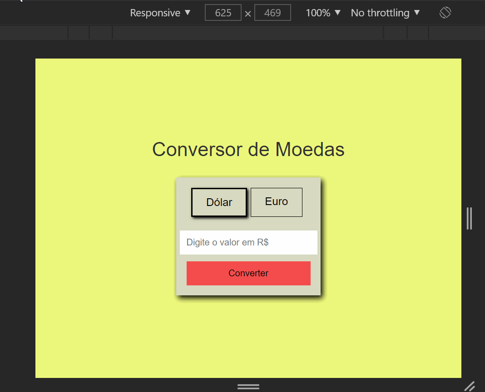

# Conversor de Moeda

### - Neste pequeno projeto pude fazer um conversor de moeda utlizando uma API web. Até aqui sempre estava trabalhando nos meus programas com dados que eu inseria na minha aplicação. Mas neste conversor os dados são recebidos de uma API web através da função fetch() do JavaScript, ou seja, os dados tanto da cotação do dólar quanto do euro são reais e eles mudam conforme a cotação do dia!  

### - Nesta aplicação foram usados as seguintes tecnologias:

#### *HTML.
#### *CSS.
#### *JavaScript
#### *API web https://exchangeratesapi.io/

### Front End para desktop e mobile 

### Veja o projeto você mesmo! Acesse: https://conversordolareuro.netlify.app/

### Gostou do meu projeto? :D Entre em contato comigo! 
[Linkedin](https://www.linkedin.com/in/lucas-rosa-058683102/)  
[Email: lucasmetron@gmail.com](mailto:lucasmetron@gmail.com)